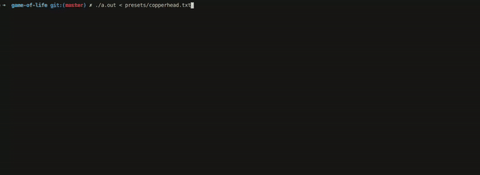

# Как запускать?
На MacOS:
```
gcc -Wall -Wextra -Werror -lncurses game_of_lefe.c
```
На Linux:
```
gcc -Wall -Wextra -Werror game_of_lefe.c -lncurses
```
появится скомпилированныый файл **a.out**, нужно будет запустить его перенаправив поток ввода.
```
./a.out < presets/test.txt
```

## Пример работы
